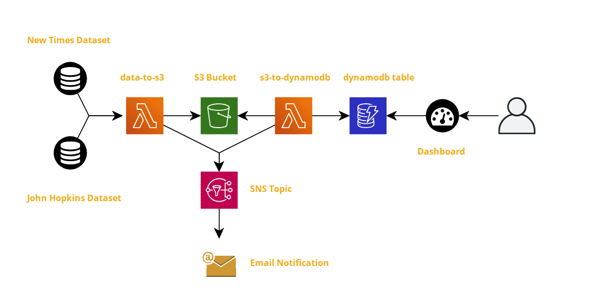

# #CloudGuruChallenge Sept 2020 - Event-Driven Python on AWS
A Cloud Guru ran a cloud challenage to build an event driven python ETL using covid data from the New York Times and John Hopkins data sets.

[Offical Project Challenge Post](https://acloudguru.com/blog/engineering/cloudguruchallenge-python-aws-etl)

## Challenge Goal
Automate an ETL processing pipeline for COVID-19 data using Python and cloud services. 

## Challenge Outcome
- [Live Demo (Note: Dashboard expired)](app.redash.io/timothygithinji/dashboard/us-covid-data)

## Architecture

These are the following AWS resources used in this project:

- AWS Lambda - Used to create ETL function of the of the project using Python.
- S3 - Used to store the tranformed data before loading into dynanmoDB.
- EventBridge - Used to trigger the s3-to-dynamodb lambda and schedule the data-to-s3 everyday.
- SNS - Used to send a message notifying by email when both lambdas are run.
- DynanmoDB - Used to store the data in NoSQL DB.

## Project Structure
- `services/` - This directory contains the two lambda services 
  - `data-to-s3/` - This directory contains the data-to-s3 service with all the files need to deploy.
    - `node_modules/` - This directory contain the node modules used by the serverless framework to deploy.
    - `venv/` - This directory contains the python module used in this service.
    - `data.py` - This python script in the Extract and Transform Function of the Lambda.
    - `handler.py` - This is the Module that is ran by Lambda which loads the data into S3.
    - `serverless.yml` - This is the serverless framework config file.
    - `package.json` - This file containes the NPM package.
    - `requirements.txt` - This file contains all the python module dependenies for this service.
    - `test_data.py` - This file contains the unit test for data.py.
    - `test_handler.py` - This file contains the unit test for handler.py.
  - `s3-to-dynamodb/` - This directory contains the s3-to-dynamodb service with all the files need to deploy.
  - `node_modules/` - This directory contain the node modules used by the serverless framework to deploy.
    - `venv/` - This directory contains the python module used in this service.
    - `handler.py` - This is the Module that is ran by Lambda which loads the data into S3.
    - `serverless.yml` - This is the serverless framework config file.
    - `package.json` - This file containes the NPM package.
    - `requirements.txt` - This file contains all the python module dependenies for this service.
    - `test_handler.py` - This file contains the unit test for handler.py.

## Conclusion
This project was very intersting, I was looking for something new to learn after i complete my SA certification. My biggest take away was definalty the use of lambda and trying the deploy function with a devops mindset. I would like to learn unit testing more and this is something i will update in the future.
